# MediMinder

_Melanie, Sarah and Jennifer_

**MediMinder**  
MediMinder is a comprehensive pharmacy management application designed to streamline the tracking of medications, doctors, patients, and prescriptions. With its intuitive interface, the app makes it easy to add, edit, or delete patient, doctor, and medication records. It also includes powerful features like a search function and automated report generation, such as inventory summaries and expired medication alerts.

The user-friendly menu ensures a seamless experience, allowing users to navigate and operate the app with minimal effort. MediMinder is the perfect tool to simplify pharmacy operations and enhance efficiency.

## How to Download

### Using Git

1. Open a terminal or command prompt.
2. Navigate to the directory where you want to download the repository.
3. Use the following command to clone the repository:

   ```bash
   git clone https://github.com/Gerogie18/Advanced-Java-Sprint-1---Melanie--Sarah--Jennifer.git
   ```

### Using GitHub Desktop

1. Download and install GitHub Desktop from the [official website](https://desktop.github.com/).
2. Open GitHub Desktop and sign in to your GitHub account.
3. Click on **"File" > "Clone Repository"** in the top menu.
4. Enter the repository URL or select a repository from your GitHub account.
5. Choose a local directory to download the repository.
6. Click **"Clone"** to start the download process.

### Using a ZIP File

1. Go to the GitHub repository page.
2. Click on the **"Code"** button.
3. Select **"Download ZIP"** from the dropdown menu.
4. Choose a location to save the ZIP file.
5. Extract the contents of the ZIP file to a directory.

---

### Prerequisites

Before running the application, ensure you have the following installed:

- **Java Development Kit (JDK)** (Download from [Oracle](https://www.oracle.com/java/technologies/javase-downloads.html) or [OpenJDK](https://openjdk.org/))

## How to Use

MediMinder is a simple text-based application that uses inputs from the user to generate the required information or task. It has a main menu that lists the various tasks available, with a corresponding number to input for each task.

Inside of the menu, once a task is chosen, there is a submenu that functions in the same manner as the main menu. The user chooses again by inputting the number corresponding to the task they wish to run.

### Steps:

### Main Menu

When you run the program, you will see the following welcome message and menu:

| **===== Welcome To The Pharmacy Med Tracking System =====** |
| ----------------------------------------------------------- |
|                                                             |
| **Main Menu Options:**                                      |
| 1: Add/Delete a patient, doctor, or medication              |
| 2: Edit details for a patient, doctor, or medication        |
| 3: Search                                                   |
| 4: Prescription Management                                  |
| 5: Generate Reports                                         |
| 6: Exit                                                     |
|                                                             |
| **Please choose an option:**                                |

2. Select the type of task you wish to run by inputting the corresponding number in the option field. This will bring you to that task's specific sub menu.
3. Select the specific task in the sub menu you wish to run. Depending on the task, there might be additional text inputs for you to enter.

The program will complete the required task and will notify you if it was successful or not.

---

## Examples

### Adding a Patient:

1. Input `1` from the main menu to enter the Add/Delete submenu.
2. Input `1` from the Add/Delete submenu.
3. The program will require the patient’s information from you. Follow the prompts to enter the correct information as requested:
   - Patient’s first name
   - Patient’s last name
   - Patient’s date of birth in the following format: YYYY/MM/DD
   - Patient’s 10-digit phone number
4. The application will add the patient. If the patient is added correctly, you will see this message:
   `“New patient added with id: 1XXXXXXX“` followed by the newly created patient ID.
5. You may select any of the Add/Delete submenu options to continue adding or deleting information, or you can choose option `7` to exit and return to the main menu.

---

## Class Relationship Diagram

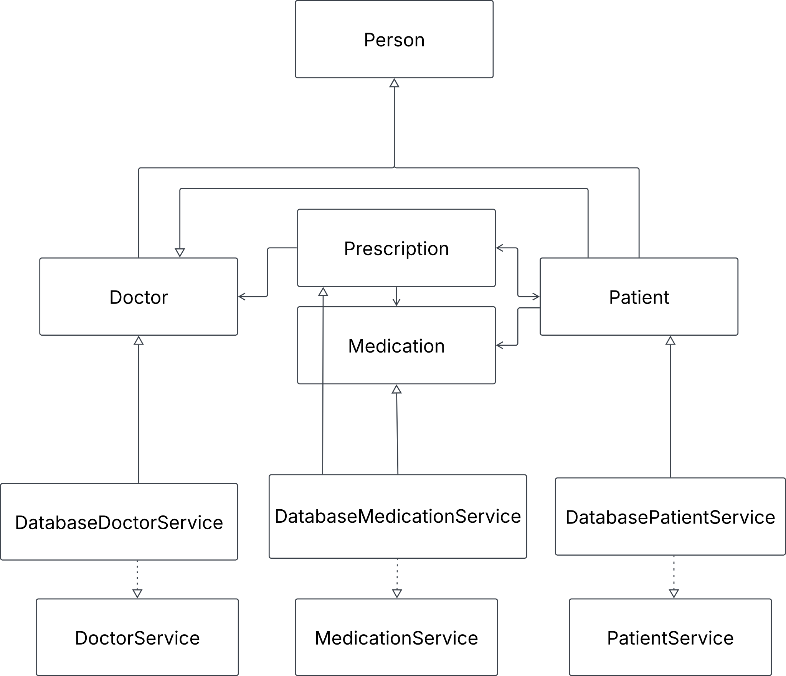

## UMLS

### Person Class

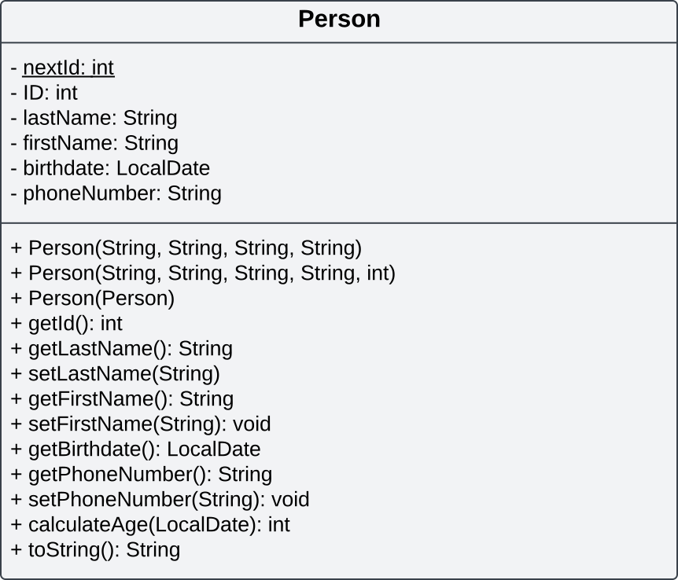

### Patient Class

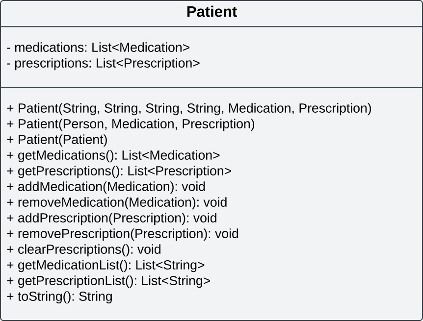

### Doctor Class

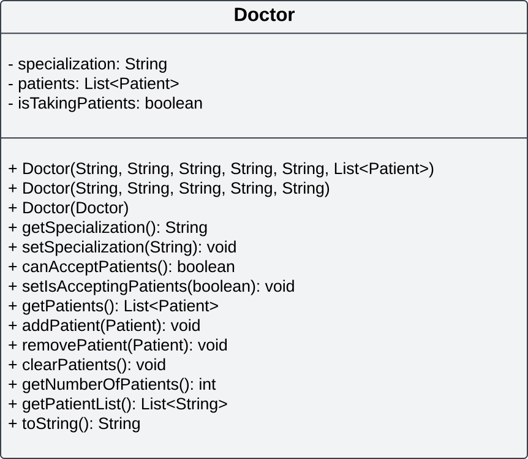

### Medication Class

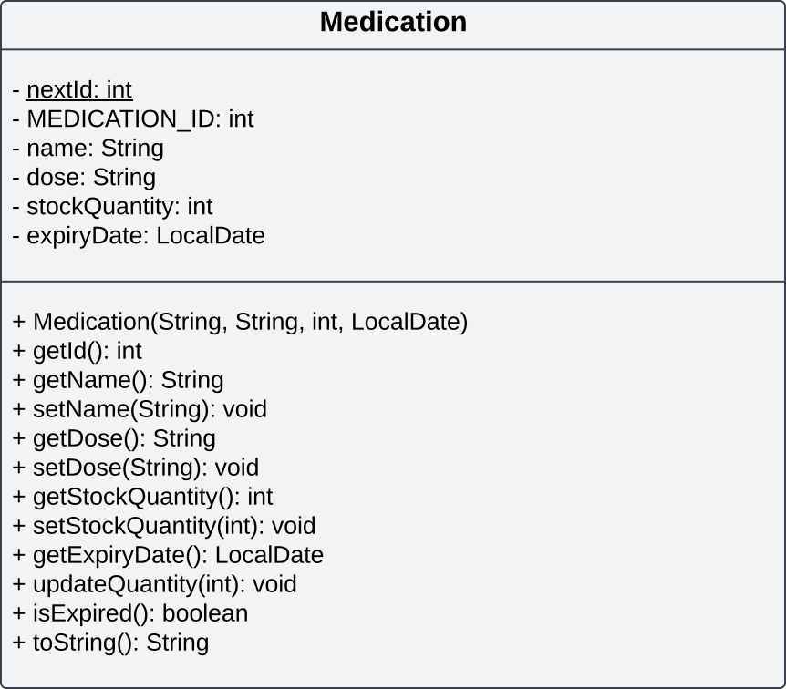

### Prescription Class

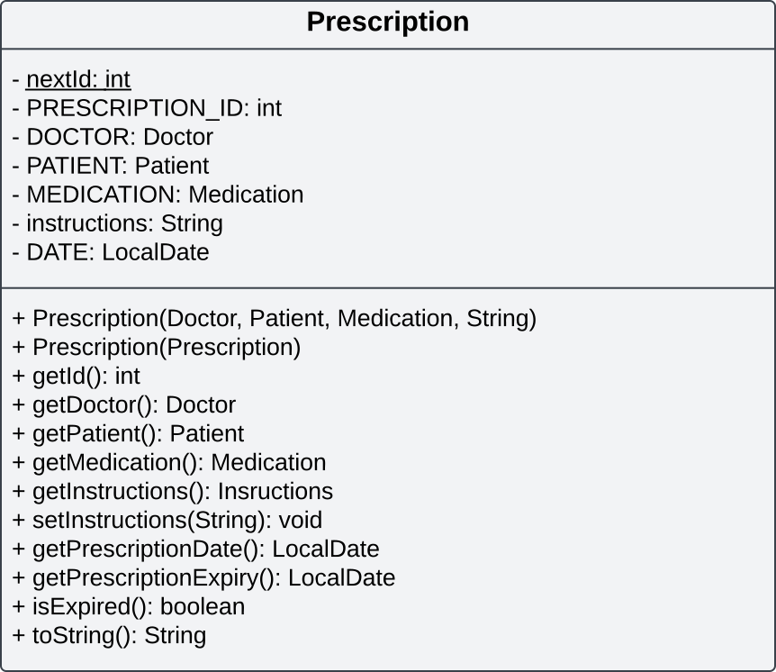

### Patient Service

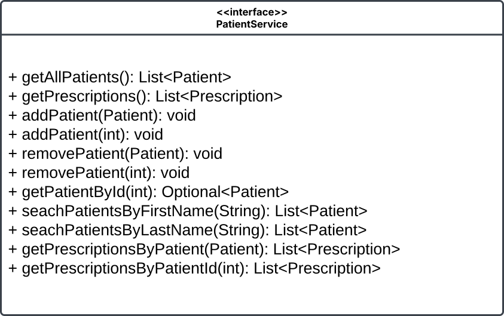

### Doctor Service


### Medication Service

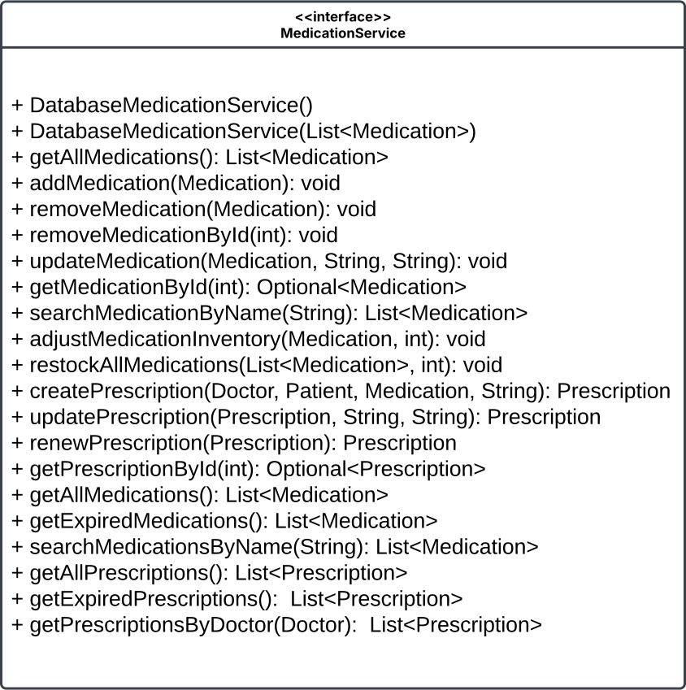

### Database Patient Service

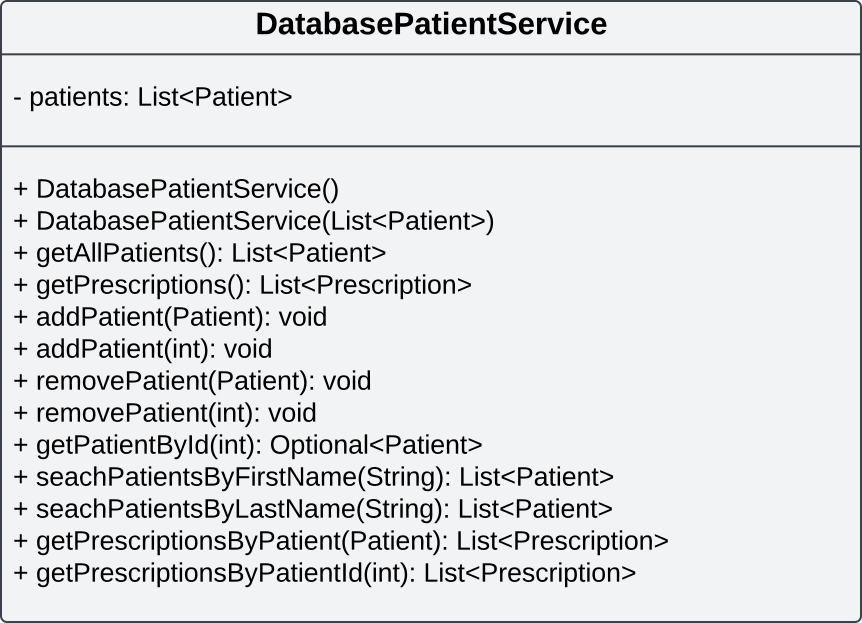

### Database Doctor Service

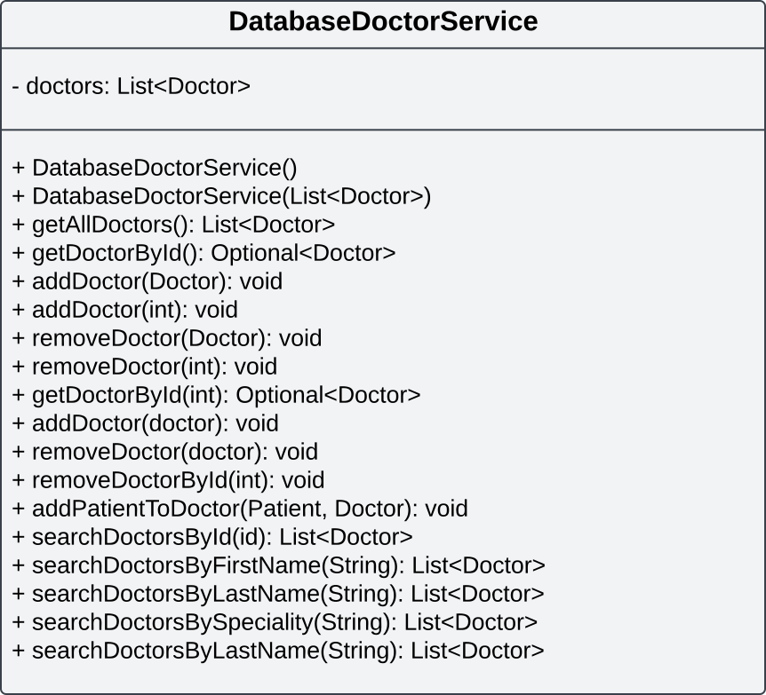

### Database Medication Service

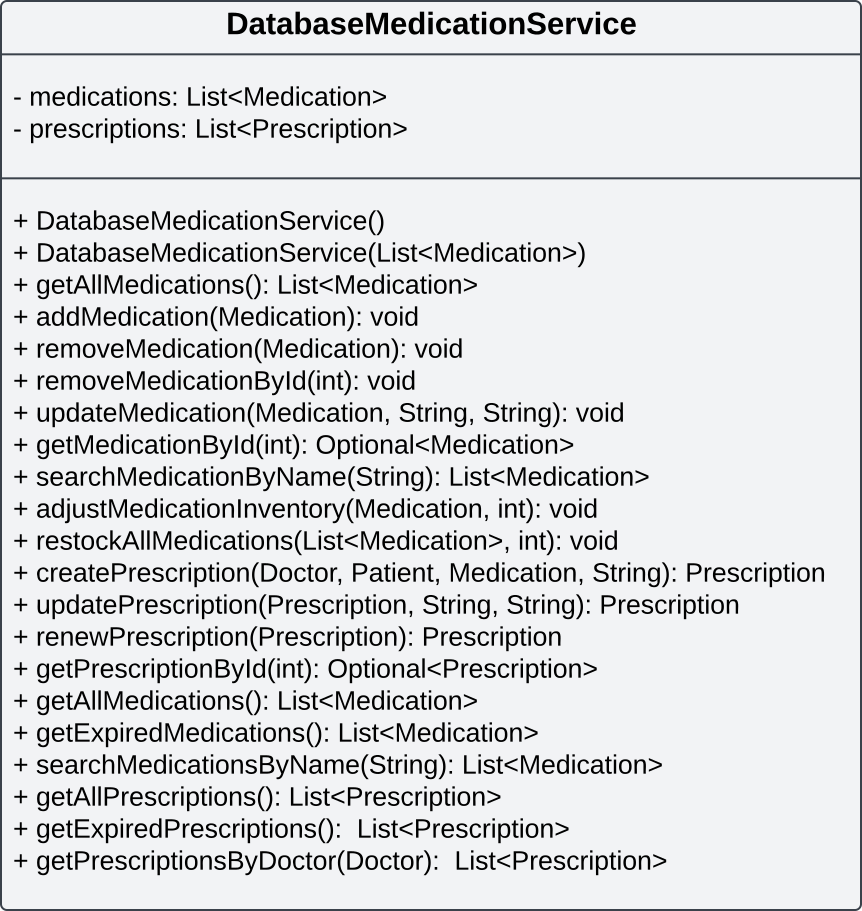

```

```
